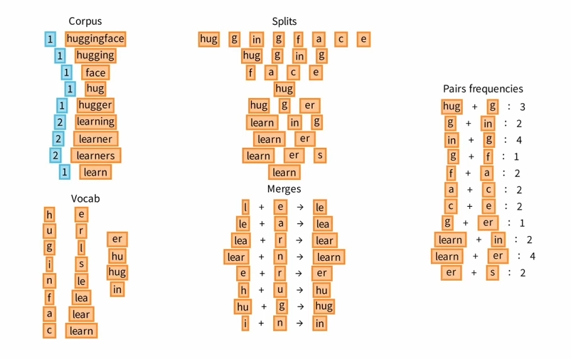

# Byte Pair Encoding (BPE)

## 1. Giới thiệu
- **Byte Pair Encoding (BPE)** ban đầu là một kỹ thuật nén dữ liệu.
- Trong **Xử lý ngôn ngữ tự nhiên (NLP)**, BPE được dùng để **tokenize văn bản thành subword units**.
- Mục tiêu chính:
  - Giảm kích thước từ điển (vocab).
  - Xử lý được **từ mới (OOV - Out Of Vocabulary)**.
  - Dung hòa giữa **word-level tokenization** (vocab quá lớn) và **character-level** (chuỗi quá dài).

---

## 2. Ý tưởng chính
1. Bắt đầu từ vocab **ký tự**.
2. Đếm tần suất xuất hiện của **cặp ký tự/subword liên tiếp** trong corpus.
3. Ghép cặp xuất hiện nhiều nhất thành một **token mới**.
4. Lặp lại cho đến khi đạt số lượng vocab mong muốn (ví dụ 16k).

Kết quả:  
- Những từ phổ biến được giữ nguyên.  
- Những từ hiếm được tách thành các **subword**.

---

