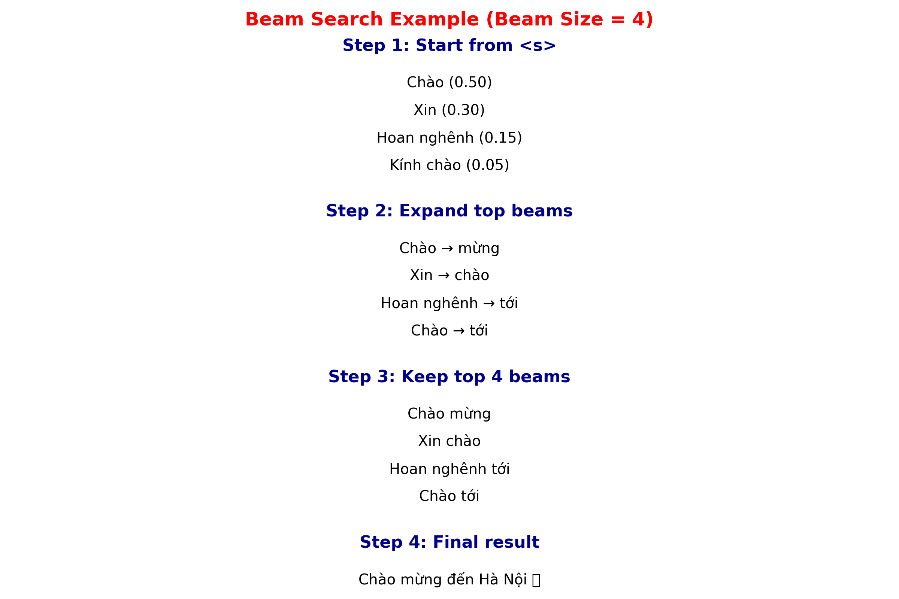
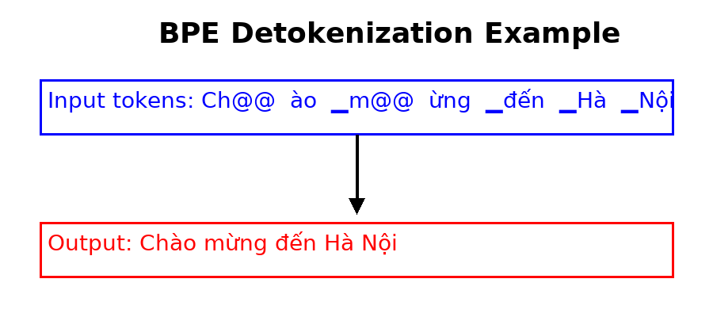

# Báo cáo: Beam Search và Ứng dụng trong Image-to-Text Translation

## Quy trình sinh logits từ decoder

**Bước 1**: Context vectors được tính bằng công thức:

$$\text{Context} = \text{Values} \times \text{Cross-Attentions}$$

**Bước 2**: Context vectors được cộng/trộn với **decoder hidden state**.

**Bước 3**: Kết quả đi qua **feed-forward layer** để sinh ra **logits** – một vector có kích thước bằng vocab (số lượng từ trong từ điển).

---

## Công thức logits

$$z_t = W \cdot h_t + b$$

Trong đó:
- $h_t$: hidden state tại bước $t$ (đã kết hợp context vector qua cross-attention)
- $W$: ma trận trọng số kích thước $|V| \times d_{\text{model}}$, với $|V|$ là kích thước vocab
- $b$: vector bias
- $z_t$: **logits**, là một vector độ dài $|V|$. Mỗi phần tử trong $z_t$ là một "điểm số thô" cho từng token trong vocab

---

## Từ logits → phân phối xác suất

Để biến logits thành phân phối xác suất trên toàn vocab, ta áp dụng **softmax**:

$$P(y_t = v \mid y_{<t}, X) = \frac{\exp\left(z_t^{(v)}\right)}{\sum_{v'} \exp\left(z_t^{(v')}\right)}$$

Trong đó:
- $z_t^{(v)}$: logit tương ứng với token $v$
- Mẫu số: tổng chuẩn hóa để đảm bảo tất cả xác suất cộng lại bằng 1

---

- **Softmax(logits)** = phân phối xác suất trên các token
- **Beam Search** = sử dụng log-probability từ softmax để chọn ra chuỗi token tốt nhất

## I. Giới thiệu

**Beam Search** là một thuật toán tìm kiếm **xấp xỉ tối ưu** trong các bài toán sinh chuỗi (*sequence generation*).

- Ở mỗi bước giải mã, thay vì chỉ chọn **một token có xác suất cao nhất** như **Greedy Search**,
  Beam Search sẽ giữ lại **$B$ ứng viên tốt nhất** (gọi là *beam width* $B$).

- Mỗi ứng viên này lại được mở rộng ở bước tiếp theo,
  và sau đó ta tiếp tục chọn ra **$B$ ứng viên tốt nhất toàn cục**.

- Quá trình lặp lại cho đến khi gặp token kết thúc `<eos>` hoặc đạt độ dài tối đa.

- Kết quả cuối cùng là chuỗi có **điểm log-xác suất (score)** cao nhất trong danh sách *beam* đã hoàn thành.

> Nói cách khác: Beam Search "song song cân nhắc nhiều khả năng", giúp tránh rơi vào **nghiệm cục bộ (local optimum)** của Greedy Search.

**Ứng dụng trong:**
- Dịch máy (Machine Translation)
- OCR end-to-end
- Nhận dạng giọng nói (ASR)
- Image Captioning
- Image-to-Text Translation

---

## 2. Xác suất chuỗi

Với đầu vào $X$, mô hình sinh ra chuỗi $Y = (y_1, y_2, \ldots, y_T)$.

**Công thức xác suất:**

$$P(Y|X) = \prod_{t=1}^{T} P(y_t | y_{<t}, X)$$

**Log-probability:**

$$\log P(Y|X) = \sum_{t=1}^{T} \log P(y_t | y_{<t}, X)$$

---

## 3. Score trong Beam Search

Để cân bằng câu ngắn và dài, dùng **length penalty**:

$$\text{score}(Y) = \frac{\log P(Y|X)}{\left(\frac{5 + |Y|}{6}\right)^\alpha}$$

Trong đó:
- $|Y|$: độ dài chuỗi
- $\alpha \in [0.4, 0.8]$, thường chọn $\alpha = 0.6$

---

## 4. Thuật toán Beam Search

### Khái niệm Beam Width
- **Beam width** $B$: số lượng ứng viên tốt nhất được giữ lại ở mỗi bước
- Nếu $B = 1$: Beam Search trở thành **Greedy Search**
- Nếu $B = \infty$: trở thành **Exhaustive Search**

### Quy trình thực hiện:

1. **Khởi tạo:** bắt đầu từ BOS token `<s>`, chọn top-$B$ token đầu tiên

2. **Mở rộng:** với mỗi beam $Y^{(i)}_{1:t-1}$, mở rộng token mới $y_t$:

   $$\hat{Y}^{(i,j)}_{1:t} = \left(Y^{(i)}_{1:t-1}, y_t^{(j)}\right)$$

   Tính score:

   $$\text{score}\left(\hat{Y}^{(i,j)}_{1:t}\right) = \frac{\log P\left(\hat{Y}^{(i,j)}_{1:t} \mid X\right)}{\left(\frac{5+t}{6}\right)^\alpha}$$

3. **Chọn lọc:** giữ lại $B$ beam tốt nhất

4. **Dừng:** khi tất cả beam sinh EOS `<eos>` hoặc đạt độ dài tối đa

---

## 5. Ví dụ chi tiết Beam Search ($B = 4$)

**Bài toán:** Dịch ảnh có chữ *"Welcome to Hanoi"* sang tiếng Việt.
**Mục tiêu:** Chọn được câu dịch tự nhiên **"Chào mừng đến Hà Nội"**.

### 5.1 Công thức cơ bản

**Xác suất của chuỗi:**
$$P(Y|X) = \prod_{t=1}^{T} P(y_t | y_{<t}, X)$$

**Tính trên log-probability:**
$$\text{score}(Y) = \sum_{t=1}^{T} \log P(y_t | y_{<t}, X)$$

**Chuẩn hóa độ dài:**
$$\text{LP}(T) = \frac{(5+T)^\alpha}{6^\alpha}, \quad \alpha=0.7$$

$$\text{score}_{\text{norm}}(Y) = \frac{\sum \log p}{\text{LP}(T)}$$

### 5.2 Bước 1 — Khởi tạo từ `<s>`

Top-4 token đầu tiên:

| Ứng viên       | $p$   | $\log p$ |
|----------------|------:|---------:|
| **Chào**       | 0.50  | −0.6931  |
| **Xin**        | 0.30  | −1.2040  |
| **Hoan nghênh**| 0.15  | −1.8971  |
| **Kính chào**  | 0.05  | −2.9957  |

**Alive** ($B=4$): Chào, Xin, Hoan nghênh, Kính chào
**Finished:** rỗng

### 5.3 Bước 2 — Mở rộng

**Mở rộng từ mỗi beam:**
- Sau **Chào** → mừng(0.7), tới(0.2), `<eos>`(0.1)
- Sau **Xin** → chào(0.8), `<eos>`(0.2)
- Sau **Hoan nghênh** → tới(0.7), `<eos>`(0.3)
- Sau **Kính chào** → quý vị(0.5), `<eos>`(0.5)

**Kết quả log-probability:**

| Chuỗi ứng viên    | Tính toán                    | $\log p$ |
|-------------------|-----------------------------:|---------:|
| Chào mừng         | $-0.6931 + \log(0.7)$       | −1.0498  |
| Xin chào          | $-1.2040 + \log(0.8)$       | −1.4271  |
| Hoan nghênh tới   | $-1.8971 + \log(0.7)$       | −2.2538  |
| Chào tới          | $-0.6931 + \log(0.2)$       | −2.3026  |

**Alive** ($B=4$): Chào mừng, Xin chào, Hoan nghênh tới, Chào tới

### 5.4 Bước 3 — Mở rộng tiếp

**Mở rộng từ mỗi beam:**
- Chào mừng → đến(0.8)
- Xin chào → Hà(0.85)
- Chào tới → Hà(0.8)
- Hoan nghênh tới → Hà(0.9)

**Tính log-probability:**

| Chuỗi ứng viên       | Tính toán                    | $\log p$ |
|----------------------|-----------------------------:|---------:|
| Chào mừng đến        | $-1.0498 + \log(0.8)$       | −1.2729  |
| Xin chào Hà          | $-1.4271 + \log(0.85)$      | −1.5896  |
| Hoan nghênh tới Hà   | $-2.2538 + \log(0.9)$       | −2.3592  |
| Chào tới Hà          | $-2.3026 + \log(0.8)$       | −2.5257  |

**Alive** ($B=4$): Chào mừng đến, Xin chào Hà, Hoan nghênh tới Hà, Chào tới Hà

### 5.5 Bước 4 — Thêm "Nội"

**Mở rộng từ mỗi beam:**
- Chào mừng đến → Hà(0.9)
- Xin chào Hà → Nội(0.95)
- Chào tới Hà → Nội(0.95)
- Hoan nghênh tới Hà → Nội(0.95)

**Tính log-probability:**

| Chuỗi ứng viên          | Tính toán                    | $\log p$ |
|-------------------------|-----------------------------:|---------:|
| Chào mừng đến Hà        | $-1.2729 + \log(0.9)$       | −1.3783  |
| Xin chào Hà Nội         | $-1.5896 + \log(0.95)$      | −1.6409  |
| Hoan nghênh tới Hà Nội  | $-2.3592 + \log(0.95)$      | −2.4105  |
| Chào tới Hà Nội         | $-2.5257 + \log(0.95)$      | −2.5770  |

### 5.6 Bước 5 — Kết thúc bằng `<eos>`

**Tất cả beam đều sinh `<eos>` với xác suất cao:**

| Chuỗi hoàn chỉnh              | Tổng $\log p$ | Length Penalty | Score chuẩn hóa |
|-------------------------------|-------------:|---------------:|----------------:|
| **Chào mừng đến Hà Nội**      | **−1.5350**  | 1.430         | **−1.0735**     |
| Xin chào Hà Nội               | −1.7463      | 1.430         | −1.2214         |
| Hoan nghênh tới Hà Nội        | −2.5159      | 1.430         | −1.7596         |
| Chào tới Hà Nội               | −2.6824      | 1.430         | −1.8761         |

### 5.7 Kết quả cuối cùng

Beam Search ($B=4$) chọn **"Chào mừng đến Hà Nội"** vì có:
- **Score chuẩn hóa cao nhất:** −1.0735 (ít âm nhất)
- **Ngữ nghĩa chính xác:** đúng với "Welcome to..."
- **Ngôn ngữ tự nhiên:** phù hợp với tiếng Việt

**So sánh với các phương pháp khác:**
- **Greedy Search:** có thể chọn "Xin chào" → kết quả kém tự nhiên
- **Beam=2:** có thể bỏ sót "Chào mừng đến"
- **Beam=8:** kết quả tương tự nhưng chậm hơn gấp đôi

---
## Ưu điểm và Nhược điểm

### Ưu điểm
- Cân bằng giữa **tốc độ** và **chất lượng**
- Khả năng tìm kết quả tốt hơn Greedy Search
- Có thể điều chỉnh chất lượng bằng tham số $B$

### Nhược điểm
- Tốn tài nguyên hơn Greedy Search
- Nếu $B$ quá nhỏ: dễ bỏ sót chuỗi tốt
- Nếu $B$ quá lớn: tốn chi phí, kết quả kém đa dạng

---

## II, Quy trình sau Beam Search → Detokenize BPE
Mục đích chính của Detokenize BPE là biến chuỗi token con (subword tokens) mà mô hình sinh ra thành chuỗi văn bản tự nhiên, dễ đọc.

Sau khi **Beam Search** chạy xong, ta thu được:

- **Top-1 câu ứng viên** (thường chọn chuỗi có score cao nhất).  
- Câu này hiện đang ở dạng **subword token** theo BPE, chưa phải văn bản hoàn chỉnh.

Ví dụ:
$$Y^* = [\text{"Ch@@"}, \text{"ào"}, \text{"▁m@@"}, \text{"ừng"}, \text{"▁đến"}, \text{"▁Hà"}, \text{"▁Nội"}]$$

---

### 🔹 Bước 1. Nhận top beam
- Lấy ra chuỗi token ứng viên từ Beam Search (ví dụ trên là top-1).  
- Chuỗi này bao gồm các **subword tokens** chứa ký hiệu đặc biệt như `@@` (BPE), `▁` (SentencePiece) hoặc `##` (WordPiece).

---

### 🔹 Bước 2. Ghép subword tokens
Áp dụng quy tắc của từng loại tokenizer để khôi phục từ gốc:

- **BPE (hậu tố `@@`)**  
  - Token có hậu tố `@@` ⇒ chưa kết thúc từ, nối với token sau.  
  - Ví dụ: `"Ch@@" + "ào"` → `"Chào"`

- **SentencePiece (tiền tố `▁`)**  
  - `▁` đại diện cho khoảng trắng trước từ.  
  - Ví dụ: `"▁m@@", "ừng"` → `" mừng"`

- **WordPiece (tiền tố `##`)**  
  - Token bắt đầu bằng `##` ⇒ là phần tiếp nối của từ trước đó.  
  - Ví dụ: `"Hà", "##Nội"` → `"HàNội"`

---

### 🔹 Bước 3. Ghép toàn bộ chuỗi
Thực hiện nối tokens theo quy tắc để khôi phục văn bản:

$$[\text{"Ch@@"}, \text{"ào"}, \text{"▁m@@"}, \text{"ừng"}, \text{"▁đến"}, \text{"▁Hà"}, \text{"▁Nội"}] \Rightarrow \text{"Chào mừng đến Hà Nội"}$$

---

### 🔹 Bước 4. Chuẩn hóa câu
- Loại bỏ ký hiệu đặc biệt (`@@`, `▁`, `##`)  
- Chuẩn hóa khoảng trắng (không để dư thừa)  
- Chuẩn hóa Unicode (quan trọng với tiếng Việt để hiển thị dấu chuẩn)  
- Xử lý dấu câu: bỏ khoảng trắng thừa trước `.,!?;:`  

