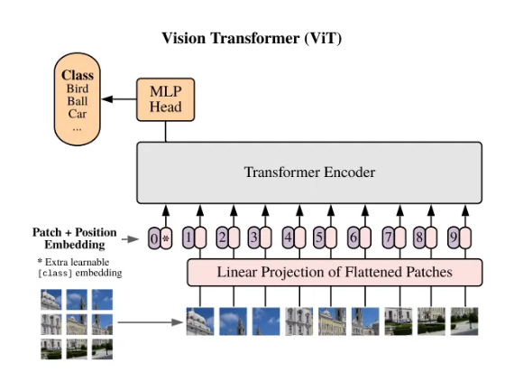
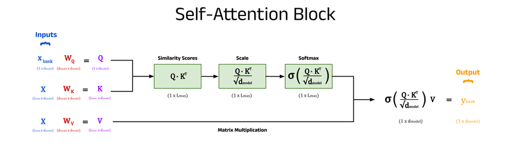
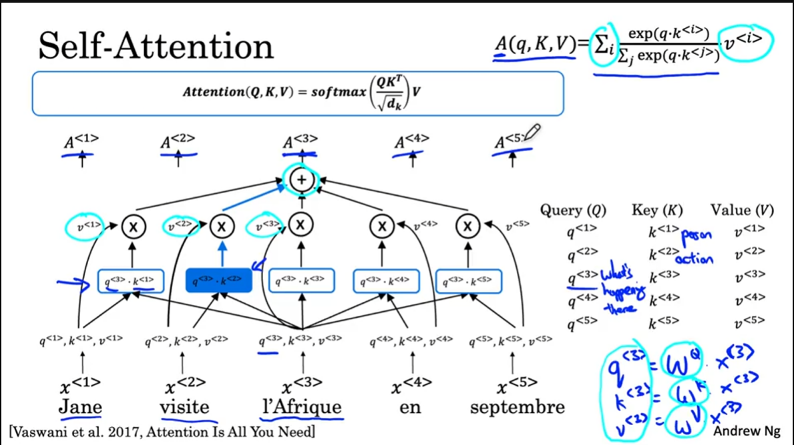

# Báo cáo: Vision Transformer (ViT) và Ứng dụng trong Image-to-Text Translation

## 1. Giới thiệu
Vision Transformer (ViT) là một mô hình deep learning áp dụng kiến trúc Transformer – vốn nổi tiếng trong xử lý ngôn ngữ tự nhiên (NLP) – vào lĩnh vực thị giác máy tính (Computer Vision).  
Thay vì sử dụng CNN (Convolutional Neural Network), ViT xử lý ảnh như một chuỗi các patch (tương tự như chuỗi từ trong NLP) và áp dụng cơ chế Self-Attention để học quan hệ toàn cục.

ViT đặc biệt hữu ích trong các bài toán cần khai thác ngữ cảnh toàn ảnh, ví dụ: **Image Captioning** hay **Image-to-Text Translation**.

---

## 2. Các bước hoạt động của ViT

### 2.1. Chia ảnh thành các patch
- Đầu vào: ảnh kích thước $ H \times W \times C $.
- Ảnh được chia thành các patch nhỏ kích thước $ P \times P $.
- Mỗi patch được "flatten" thành vector 1 chiều.

Ví dụ: Ảnh $224 \times 224$, patch $16 \times 16$ → có $14 \times 14 = 196$ patch.

---

### 2.2. Embedding các patch
Mỗi patch được chiếu tuyến tính (linear projection) thành vector có kích thước $D$.  
Điều này biến ảnh thành một chuỗi các vector, tương tự như chuỗi từ trong NLP.

Công thức embedding:
$$
z_0^i = x^i E, \quad E \in \mathbb{R}^{(P^2C) \times D}
$$

---

### 2.3. Thêm token đặc biệt [CLS]
Một vector đặc biệt **[CLS]** được thêm vào đầu chuỗi, dùng để biểu diễn toàn ảnh sau khi qua Transformer.

---

### 2.4. Thêm thông tin vị trí (Positional Embedding)
Transformer không tự biết patch nào ở đâu, do đó ta thêm **positional embedding**:  
$$
z_0 = [x_{cls}; x^1E; x^2E; ...; x^NE] + E_{pos}
$$

Điều này giúp mô hình nhận biết patch ở vị trí nào.

---

### 2.5. Transformer Encoder
Mỗi lớp Encoder gồm:

#### a. Multi-Head Self-Attention (MHSA)

- Tính Attention giữa các patch với nhau.
- Công thức Attention:
$$
Attention(Q, K, V) = softmax\left( \frac{QK^T}{\sqrt{d_k}} \right) V
$$

Trong đó:
- $
Q = XW^Q, K = XW^K, V = XW^V .
$

Multi-head: 
$$
MultiHead(Q,K,V) = Concat(head_1, ..., head_h)W^O
$$

 

#### b. Feed Forward Network (FFN)
Mỗi patch vector đi qua một mạng MLP để học phi tuyến tính.

$$
FFN(x) = max(0, xW_1 + b_1)W_2 + b_2
$$

Các lớp này được lặp lại nhiều lần (ví dụ 12 lớp trong ViT-Base).

---

### 2.6. Kết quả đầu ra
- Vector từ [CLS] token sau nhiều lớp được coi là biểu diễn toàn ảnh.
- Với phân loại ảnh → đưa qua MLP để dự đoán nhãn.
- Với **Image-to-Text Translation** → biểu diễn ảnh sẽ được đưa vào Decoder (Transformer hoặc LSTM) để sinh ra chuỗi văn bản.

---

## 3. Ứng dụng trong Image-to-Text Translation
Trong bài toán dịch văn bản trong ảnh (Image-to-Text Translation), quy trình có thể là:

1. **ViT Encoder**: Trích xuất đặc trưng ảnh → chuỗi vector (representation).  
2. **Text Decoder**: Sinh ra chuỗi văn bản đích (ngôn ngữ cần dịch).  
   - Dùng kỹ thuật **Teacher Forcing** trong huấn luyện.  
   - Áp dụng các phương pháp sinh chuỗi: **Beam Search, Greedy Search**.  
3. **Đánh giá chất lượng** bằng các chỉ số:  
   - **CER/WER** (Character/Word Error Rate).  
   - **BLEU score** cho chất lượng dịch.

---

## 4. Ưu điểm và Nhược điểm của ViT

### Ưu điểm:
- Học quan hệ toàn cục giữa các patch.  
- Linh hoạt, có thể áp dụng kiến trúc Transformer trong thị giác.  
- Kết quả tốt hơn CNN trên dataset lớn.

### Nhược điểm:
- Cần lượng dữ liệu lớn để huấn luyện.  
- Tính toán Self-Attention có độ phức tạp $(O(N^2))$  với số patch $N$.

---

## 5. Kết luận
ViT đã mở ra một hướng mới cho thị giác máy tính khi kết hợp NLP và CV. Trong bài toán **dịch văn bản trong ảnh**, ViT đóng vai trò quan trọng trong việc trích xuất đặc trưng ảnh, sau đó kết hợp với Decoder sinh văn bản.  
ViT hứa hẹn mang lại độ chính xác cao hơn nhờ khả năng học quan hệ toàn cục.

