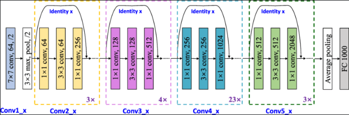
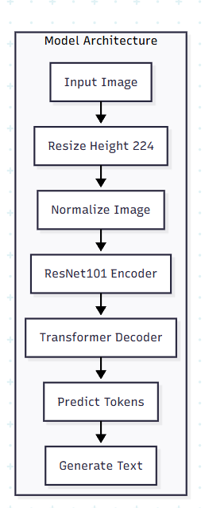
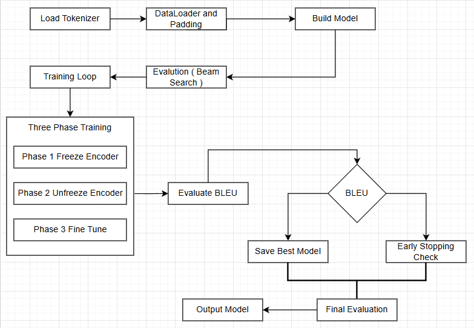
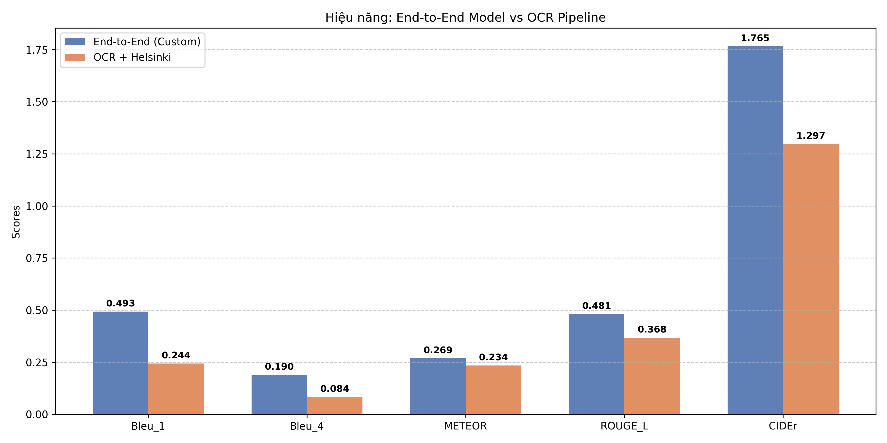

# Báo cáo Dự án Chi tiết: Dịch thuật Trực tiếp Từ Ảnh (End-to-End)

## Tóm tắt
Báo cáo này mô tả việc thiết kế, huấn luyện và đánh giá một mô hình dịch trực tiếp từ ảnh chứa văn bản tiếng Anh sang văn bản tiếng Việt (End-to-End). Mục tiêu là giảm "lan truyền lỗi" từ pipeline truyền thống (OCR → MT) và cải thiện độ bền khi ảnh bị nhiễu, méo hoặc có phông chữ lạ.

## 1. Lý do chọn đề tài (Motivation)

- **Vấn đề hiện tại (thực tế):** Phần lớn hệ thống dịch ảnh hiện nay chạy theo pipeline 2 bước: (1) OCR để chuyển ảnh thành văn bản nguồn; (2) mô hình dịch (MT) dịch văn bản đó sang ngôn ngữ đích. Khi OCR mắc lỗi (nhận nhầm ký tự, thiếu từ, sai thứ tự), sai sót sẽ được chuyển nguyên vẹn vào bước dịch và thường không thể sửa bởi MT — hiện tượng này gọi là "lan truyền lỗi" (error propagation).

- **Ví dụ:** chữ "cl" bị OCR nhận thành "d" khiến từ tiếng Anh "clap" thành "dap"; MT dịch "dap" có thể cho ra kết quả hoàn toàn khác ngữ nghĩa. Trong môi trường thực tế (ảnh mờ, góc chéo, phông chữ lạ, ánh sáng kém), tỉ lệ lỗi OCR tăng đáng kể.

- **Hệ quả:** giảm chất lượng dịch (BLEU/CER kém), tăng tỉ lệ lỗi nghiêm trọng trong ứng dụng (ví dụ: biển báo giao thông, tài liệu kỹ thuật), và làm giảm hiệu quả tự động hóa (phải can thiệp thủ công nhiều hơn).

- **Mục tiêu dự án:** Thiết kế mô hình End-to-End nhận trực tiếp ảnh và sinh văn bản đích (Tiếng Việt), nhằm:
	- Giảm phụ thuộc vào OCR truyền thống và do đó giảm lan truyền lỗi.
	- Tận dụng thông tin hình ảnh toàn cục (bối cảnh, layout, ký tự lân cận) để phục hồi hoặc phân biệt các ký tự/từ bị mờ.
	- Cải thiện hiệu suất trên ảnh nhiễu, phông chữ bất thường hoặc dữ liệu thực địa không chuẩn.

- **Lợi ích kỳ vọng:** tăng BLEU/CIDEr/METEOR/ROUGE_L trên tập test thực tế, giảm CER/WER so với pipeline OCR+MT, và giảm tổng latency bằng cách hợp nhất bước xử lý.

- **Câu hỏi nghiên cứu:**
	1. Mô hình End-to-End có khả năng sửa lỗi OCR (như phục hồi từ/building context) hay không? Nếu có, trong những điều kiện nào (nhiễu, font, kích thước)?
	2. So sánh độ phức tạp/tài nguyên: khi nào dùng Transformer end-to-end là khả thi so với phương pháp kết hợp OCR nhẹ + MT?
	3. Những kỹ thuật augmentation/regularization nào giúp mô hình học được khả năng khử nhiễu tốt nhất?

- **Phạm vi áp dụng:** Ứng dụng trong dịch biển báo, tài liệu ảnh, ảnh chụp màn hình ứng dụng, và hệ thống hỗ trợ người dùng không đọc được ngôn ngữ nguồn.

## 2. Kiến thức nền tảng (Theoretical Background)

Phần này mô tả các khái niệm ML cơ bản và cách áp dụng chúng cho bài toán dịch trực tiếp từ ảnh (Image-to-Text Translation).

### 2.1 Mô hình Sequence-to-Sequence cho Image-to-Text
- Mục tiêu: ánh xạ một ảnh chứa văn bản $I$ sang chuỗi token ngôn ngữ đích $y_{1:L}$. Thiết kế phổ biến là một bộ mã hóa hình ảnh (encoder) để trích xuất đặc trưng, nối với một bộ giải mã (decoder) autoregressive để sinh token.

### 2.2 Encoder (Visual)
- CNN-based: Sử dụng ResNet/EfficientNet để sinh feature map $M\in\mathbb{R}^{h\times w\times d}$; có thể flatten thành chuỗi $F\in\mathbb{R}^{T\times d}$ (với $T=h\cdot w$) để làm keys/values cho attention.
- Vision Transformer (ViT): chia ảnh thành patch $p\times p$, ánh xạ mỗi patch sang vector embedding và thêm positional encoding, tạo chuỗi biểu diễn trực tiếp.

Ví dụ patch embedding:
$$x_{patch}^i = E\cdot\mathrm{vec}(I_{patch}^i) + p_i, \quad i=1..N$$

### 2.3 Decoder (Text)
- Transformer decoder: dùng self-attention (trong token đích) và cross-attention (tương tác với visual features) để sinh token theo kiểu autoregressive. Khi huấn luyện thường dùng teacher forcing; loss chính là Cross-Entropy trên phân phối token.
- RNN-based (GRU/LSTM): lựa chọn nhẹ hơn, có thể kết hợp attention thủ công nếu muốn giảm chi phí tính toán.

### 2.4 Attention
- Scaled dot-product attention (cốt lõi của Transformer): với truy vấn $Q$, khóa $K$ và giá trị $V$:
$$\mathrm{Attention}(Q,K,V)=\mathrm{softmax}\left(\frac{QK^{\top}}{\sqrt{d_k}}\right)V.$$ 
- Multi-head attention kết hợp nhiều head song song:
$$\mathrm{head}_i=\mathrm{Attention}(QW_i^Q,KW_i^K,VW_i^V),\\quad \mathrm{MultiHead}=\\mathrm{Concat}(head_1,\\dots,head_h)W^O.$$ 

### 2.5 Các hàm tính độ chính xác (BLEU / CIDEr / METEOR / ROUGE_L)
Dưới đây là mô tả ngắn và các công thức chính của những metric sẽ dùng trong báo cáo để đánh giá chất lượng dịch.

- BLEU (Bilingual Evaluation Understudy): đo độ chính xác n-gram với điều chỉnh brevity penalty.
	$$\mathrm{BLEU}=\mathrm{BP}\cdot\exp\left(\sum_{n=1}^N w_n\log p_n\right)$$
	với $p_n$ là clipped n-gram precision, $w_n$ trọng số (thường $1/N$), và
	$$\mathrm{BP}=\begin{cases}1 & \text{if } c>r\\ \exp\left(1-\dfrac{r}{c}\right) & \text{if } c\le r\end{cases}$$
	($c$: độ dài câu sinh, $r$: độ dài tham chiếu).

- CIDEr: dùng TF-IDF trên n-gram và đo tương đồng cosine giữa vector TF-IDF của câu sinh và các câu tham chiếu.
	$$\mathrm{CIDEr}_n(c,S)=\dfrac{1}{m}\sum_{j=1}^m \dfrac{g_{c,n}\cdot g_{s_j,n}}{\|g_{c,n}\|\,\|g_{s_j,n}\|},\\quad \mathrm{CIDEr}(c,S)=\sum_{n=1}^4 w_n\,\mathrm{CIDEr}_n(c,S).$$

- METEOR: kết hợp precision/recall với matching mở rộng (stemming, synonym) và penalty theo số khối (chunks):
	$$F_{mean}=\dfrac{10PR}{R+9P},\quad \mathrm{penalty}=\gamma\left(\dfrac{\text{chunks}}{\text{matches}}\right)^\beta,\quad \mathrm{METEOR}=(1-\mathrm{penalty})\cdot F_{mean}.$$ 

- ROUGE-L: dựa trên Longest Common Subsequence (LCS). Với $\mathrm{LCS}(c,r)$ là độ dài LCS giữa candidate $c$ và reference $r$:
	$$R_{LCS}=\dfrac{\mathrm{LCS}(c,r)}{|r|},\\quad P_{LCS}=\dfrac{\mathrm{LCS}(c,r)}{|c|},\\quad F_{LCS}=\dfrac{(1+\beta^2)R_{LCS}P_{LCS}}{R_{LCS}+\beta^2P_{LCS}}.$$ 
	(thường chọn $\beta=1$ để lấy F1).

## 3. Phương pháp tiếp cận (Approach)

### 3.1 Kiến trúc mô hình (Model Architecture)
Dự án sử dụng mô hình CNN-Transformer kết hợp cơ chế Attention để thực hiện dịch trực tiếp từ hình ảnh sang văn bản (End-to-End):
- **Encoder (Bộ mã hóa hình ảnh):**
	- Cách 1 — *ResNet-based*: Sử dụng ResNet-101 (pretrained trên ImageNet) làm backbone để trích xuất đặc trưng thị giác. Lược bỏ 2 lớp cuối (Global Average Pooling và Fully Connected) để giữ lại thông tin không gian dưới dạng Feature Map. Áp dụng một lớp Linear Projection chuyển chiều từ 2048 (output ResNet) xuống không gian nhúng của Transformer (512 chiều) để làm `keys/values` cho attention.
	- Cách 2 — *Vision Transformer (ViT)*: thay thế ResNet bằng ViT (patch embedding). Chia ảnh thành các patch kích thước p x p, ánh xạ mỗi patch sang embedding, cộng positional encoding và đưa qua một stack transformer encoder để thu được chuỗi feature vectors. Sau đó dùng một linear projection (nếu cần) để map chiều của patch-embedding về 512 chiều (phù hợp với decoder). Có thể tải weights pretrained (ImageNet21k / DeiT) để tăng tốc hội tụ.

	- So sánh nhanh: ResNet giữ tốt đặc trưng cục bộ và thường ổn định trong tài nguyên hạn chế; ViT mạnh ở học biểu diễn toàn cục và có thể nắm được dependencies dài trên ảnh, nhưng cần nhiều dữ liệu hoặc pretraining.

- **Decoder (Bộ giải mã văn bản):**
	- Transformer Decoder với 3 layers, mỗi layer có 8 attention heads (multi-head self-attention và cross-attention).
	- Tích hợp Positional Encoding dạng sin/cos để mã hóa vị trí token trong câu.
	- Cross-attention: decoder dùng queries từ token đích và keys/values từ feature sequence của encoder để tập trung vùng ảnh liên quan khi sinh từng token tiếng Việt.

### 3.2 Tiền xử lý dữ liệu (Data Preprocessing)
Quy trình xử lý được thiết kế để cả hai kiến trúc encoder (CNN-based và ViT) có biểu diễn phù hợp, đồng thời xử lý những ảnh rất dài (wide) bằng cơ chế sliding-window khi cần.

- **Chung (common):**
	- Resize giữ tỉ lệ với chiều cao cố định `H=224` px (hoặc `H=256` cho thí nghiệm khác); điều chỉnh chiều rộng theo tỉ lệ gốc và giới hạn `W_{max}` (ví dụ `1890` px). Ảnh nhỏ hơn sẽ được pad bằng giá trị 0 và collate vào batch.
	- Augmentations: dùng `albumentations` (Rotate(limit=±5°), `RandomBrightnessContrast`, `GaussianNoise`/`GaussianBlur`, `ShiftScaleRotate` nhẹ khi hợp lý), sau đó `Normalize` theo ImageNet mean/std.
	- Text tokenization: dùng SentencePiece / VinAI-BartPho; thêm token đặc biệt `<s>` (BOS) và `</s>` (EOS); padding/truncation theo max target length.

- **ResNet-style (CNN) preprocessing:**
	- Sau resize/pad, đưa ảnh vào backbone ResNet như bình thường: giữ feature map không gian (ví dụ output 2048-channels từ conv stage cuối), sau đó áp dụng `Linear` projection để map chiều kênh về `d_model` của decoder (ví dụ 512).
	- Dynamic-width vẫn hữu ích: flatten feature map thành sequence (T = h*w) để dùng làm keys/values cho cross-attention.

- **ViT-specific preprocessing & theory:**
	- Patch embedding: chia ảnh thành patch vuông kích thước `p x p` (ví dụ `p=16`). Mỗi patch được flatten và ánh xạ qua embedding `E`:
		$$x_{patch}^i = E\cdot\mathrm{vec}(I_{patch}^i) + p_i$$
		với `p_i` là positional encoding 2D (hoặc học được).
	- Đảm bảo ảnh có kích thước (H, W) sao cho cả hai chiều là bội số của `p` khi có thể; nếu không, pad tới bội nhỏ nhất hoặc dùng partial patch với masking.
	- Dùng relative/2D positional encoding để giữ thông tin vị trí bản đồ chữ (tốt hơn absolute 1D cho hình dài).

- **Xử lý ảnh dài (Long / Wide images) bằng Sliding Window (ViT & CNN):**
	- Khi `W > W_{max}` hoặc số patch theo chiều ngang quá lớn để xử lý cùng lúc, áp dụng sliding-window theo chiều ngang (hoặc theo chiều dọc nếu cần):
		- Chuyển cửa sổ (window) có kích thước `W_{win}` (ví dụ tương đương `H` theo tỉ lệ patch, hoặc số patch ngang tối đa ~512) với overlap `o` (ví dụ `o = 0.25..0.5 * W_{win}`) để giữ bối cảnh chồng chéo giữa các cửa sổ.
		- Với mỗi window: thực hiện patch-embedding (ViT) hoặc crop→ResNet→feature-map (CNN), sinh sequence feature riêng cho cửa sổ đó.
		- Gắn positional offsets vào patch-positional-encoding để giữ thông tin vị trí tuyệt đối trên toàn ảnh (ví dụ offset patch-index += window_start_patch_index).
	- Tích hợp kết quả nhiều cửa sổ:
		- Cách 1 (concatenate & attention): nối các sequence từ các cửa sổ (giữ thứ tự theo vị trí) và chuyền cho decoder cross-attention; nếu số token quá lớn, áp dụng local attention hoặc tuyến tính hóa bằng `pooling` trước cross-attention.
		- Cách 2 (merge logits/probs): sinh token độc lập trên từng window (hoặc beam search per-window) rồi hợp nhất xác suất bằng confidence-weighted averaging hoặc voting khi windows chồng lấp.
		- Cách 3 (hierarchical): dùng một pooling/encoder phụ để tóm tắt mỗi window thành vài vector (summary vectors), rồi decoder cross-attend vào các summary vectors trước, sau đó mở rộng nếu cần.
	- Ghi chú thực nghiệm: overlap ~25–50% thường giúp giữ ngữ cảnh xuyên cửa sổ; cần cân bằng giữa memory/latency và độ bao phủ ngữ cảnh.

- **Inference notes:**
	- Khi dùng sliding-window, beam search nên được thực hiện trên biểu diễn sau khi hợp nhất (merge) để tránh nghịch lí token-level do xử lý cục bộ.
	- Lưu checkpoints window-offsets để dễ debug alignment giữa token sinh và vị trí ảnh.

Các thông số gợi ý (thí nghiệm): `H=224`, `p=16`, `d_model=512`, `W_{max}=1890`, `W_{win}` tương ứng số patch ngang ≈ 256, overlap 25–50%.

### 3.3 Huấn luyện mô hình (Training Strategy)
Chiến lược huấn luyện theo 3-Phase Safe Gradual Fine-tuning nhằm giúp mô hình hội tụ ổn định:

- **Hàm mất mát & tối ưu:** Cross-Entropy token-level (hỗ trợ label smoothing); optimizer `AdamW` với weight_decay = 0.01; dùng mixed-precision training (`torch.cuda.amp`).

- **Chiến lược 3 giai đoạn:**
	- *Phase 1 — Warmup:* đóng băng toàn bộ Encoder (ResNet), chỉ huấn luyện Decoder để học cú pháp/ngữ pháp tiếng Việt.
	- *Phase 2 — Transition:* mở khóa Encoder, tiếp tục huấn luyện với learning rate thấp (5e-6) để thích nghi dần.
	- *Phase 3 — Fine-tune:* huấn luyện toàn bộ mô hình với learning rate rất thấp (2e-6) để tối ưu hiệu suất cuối cùng.

Các kỹ thuật hỗ trợ: gradient clipping, label smoothing, dropout, scheduler warmup + cosine/linear decay, checkpointing theo BLEU trên validation.

### 3.4 Đánh giá & Suy luận (Inference & Evaluation)
- **Inference:** sử dụng Beam Search (beam_size = 5) để sinh câu đầu ra (thay vì greedy) giúp cải thiện tính mượt và độ chính xác của câu toàn bộ.
- **Metric:** tính BLEU-4 (ví dụ dùng `nltk` hoặc `sacrebleu`) làm chỉ số chính, đồng thời báo cáo CIDEr, METEOR, ROUGE_L và CER/WER để đánh giá toàn diện.
- **Kết quả sơ bộ:** mô hình thử nghiệm đạt BLEU ≈ 28.89 tại epoch 20 trên tập validation (giá trị tham khảo từ quá trình thử nghiệm).

## 4. Kiến trúc mô hình ( Architecture )

## 5. So sánh kết quả với phương pháp truyền thống (OCR + MT)

### Nhận xét về biểu đồ hiệu năng

- **Tổng quan:** Mô hình End-to-End (ResNet101 + BARTpho) cho hiệu năng tốt hơn pipeline OCR + MT trên các metric hiển thị (BLEU_1, BLEU_4, METEOR, ROUGE_L, CIDEr).
- **Chi tiết:** BLEU_4 của E2E tăng rõ so với baseline (0.190 vs 0.084 trong biểu đồ), cho thấy cải thiện ở n-gram dài; CIDEr cũng tăng, khẳng định dự đoán E2E phù hợp hơn với tham chiếu theo TF‑IDF.
- **Ý nghĩa:** Sự cải thiện cả BLEU_1 và BLEU_4 cho thấy mô hình vừa tăng độ chính xác token đơn lẻ vừa cải thiện ngữ cảnh chuỗi; ROUGE_L/METEOR hỗ trợ kết luận về chất lượng câu tổng thể.
- **Lưu ý:** Các metric phụ thuộc vào tokenization, preprocessing và tập dữ liệu; cần báo thêm độ lệch chuẩn / khoảng tin cậy để kiểm tra ý nghĩa thống kê.
- **Hành động đề xuất:** thêm bảng số liệu (mean ± std), chèn vài ví dụ qualitative (ảnh + reference + pred) và phân tích lỗi theo nhóm (font lạ, nhiễu, tên riêng) để hiểu rõ nguyên nhân cải thiện.

## 6. Kết luận và Hướng phát triển tương lai (Conclusion & Future Work)
- **Kết luận:** Mô hình End-to-End (ResNet101 + BARTpho) đã chứng minh hiệu quả vượt trội so với pipeline truyền thống OCR + MT trong việc dịch trực tiếp từ ảnh sang văn bản tiếng Việt, giảm thiểu lan truyền lỗi và cải thiện chất lượng dịch.
- **Hướng phát triển tương lai:**
	- Thử nghiệm với kiến trúc ViT để tận dụng biểu diễn toàn cục của ảnh.
	- Nghiên cứu kỹ thuật augmentation nâng cao để cải thiện độ bền với ảnh nhiễu.
	- Tối ưu hóa latency và tài nguyên để triển khai thực tế trên thiết bị di động hoặc hệ thống nhúng.
	- Mở rộng sang các ngôn ngữ khác và các loại văn bản phức tạp hơn (ví dụ: bảng biểu, tài liệu đa cột).
- **Tài liệu tham khảo:** các bài báo, tài liệu và mã nguồn đã tham khảo trong quá trình thực hiện dự án.
	- [Attention Is All You Need](https://arxiv.org/abs/1706.03762)
	- [BARTPho: Pre-trained Sequence-to-Sequence Models for Vietnamese NLP](https://arxiv.org/abs/2106.04398)
	- [Image Captioning with Transformers](https://arxiv.org/abs/2005.00556)
	- [Tesseract OCR](https://github.com/tesseract-ocr/tesseract)
	- [Hugging Face Transformers Documentation](https://huggingface.co/docs/transformers/index)

